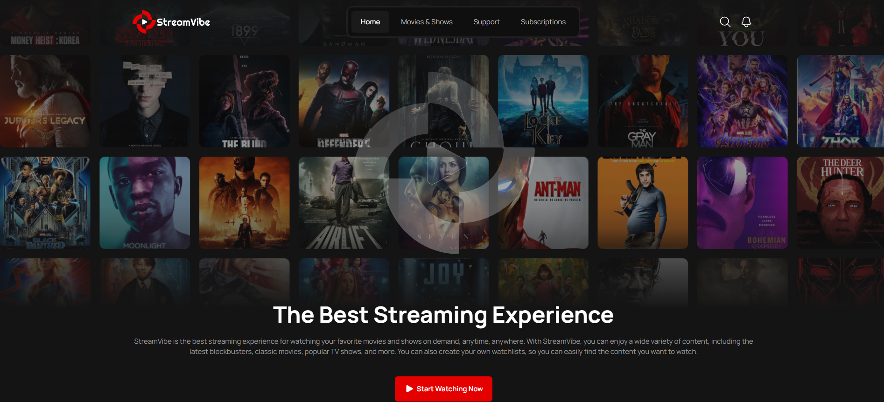

**Front-end - StreamVibe, streaming service.**
-----------------------
Built using JavaScript, Minista, Vite, React.


📸 **Screenshot**
-----------------------



🚀 **Online version**
-----------------------

Open:
https://stream-vibe-seven-iota.vercel.app/


⚙️ Used technologies
-----------------------

- JavaScript (ES6+)
- HTML5, SCSS
- Minista, Vite
- React

📦 Local installation
-----------------------
```bash
git clone https://github.com/torataishou/stream-vibe
cd stream-vibe
npm install
npm start
```

📁 Mockup
-----------------------
https://www.figma.com/design/uIo0pJQqAJCvSyyPQonMZQ/StreamVibe?m=auto&t=zKel0Iatp5XoyVY3-6

📄 License
-----------------------
### **MIT License**